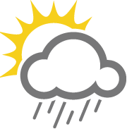

============
Meteocollect
============

:Autori:
  Alessandro Parma,
  Mirco Bertelli

:Versione: 0.1

Brief Description
=================

Web application for logging and presenting environmental data collected and
delivered through REST interface.

License
=======

licensed under the
`GPL Version 2 <http://www.gnu.org/licenses/old-licenses/gpl-2.0.html>`_.

Indice
======

.. toctree::
    :maxdepth: 2

    meteocollect
    installazione
